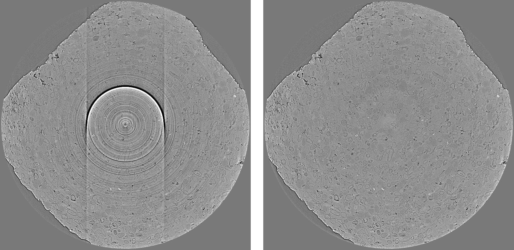

Sarepy's documentation
======================

Welcome to Sarepy's documentation about removing ring artifacts in tomography.
This documentation is not only to explain functions used in the Sarepy package
but also to cover the following topics:

- Causes of ring artifacts.
- Classification of ring artifacts.
- How ring removal methods work; pros and cons of each method; how to use them efficiently; and how to improve them.
- Applications of the methods.

**Source code:** https://github.com/nghia-vo/sarepy

**Author:** Nghia Vo, Diamond Light Source.

**Keywords:** ring artifact removal, tomography, stripe artifacts, tutorial.

*Importance notice:*
--------------------
Starting 05/2021, methods in **Sarepy** have been integrated and developed further in
the **Algotom** package, https://github.com/algotom/algotom . Algotom is a
complete software package for processing tomographic reconstruction. It is
installable using Conda and Pip.

Table of Contents
=================

.. toctree::
    :numbered:
    :maxdepth: 3

    toc/section1
    toc/section2
    toc/section3
    toc/section4
    toc/section5

References
==========

.. _references:

1. Nghia T. Vo, Robert C. Atwood, and Michael Drakopoulos, "Superior
   techniques for eliminating ring artifacts in X-ray micro-tomography," Optics
   Express 26, 28396-28412 (2018); https://doi.org/10.1364/OE.26.028396.
2. Nghia T. Vo, Robert C. Atwood, and Michael Drakopoulos, "Preprocessing
   techniques for removing artifacts in synchrotron-based tomographic images,"
   Proc. SPIE 11113, Developments in X-Ray Tomography XII, 111131I
   (10 September 2019); https://doi.org/10.1117/12.2530324.

License
=======
    `Apache License, Version 2.0 <http://www.apache.org/licenses/LICENSE-2.0>`_.
