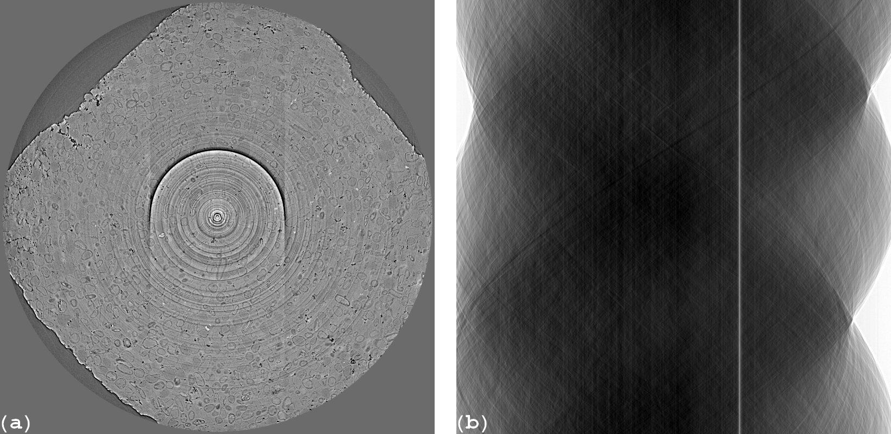
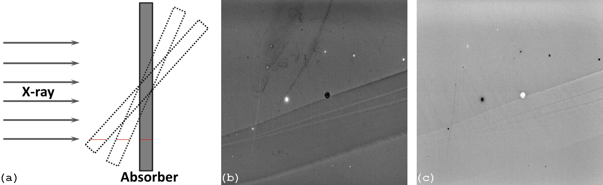
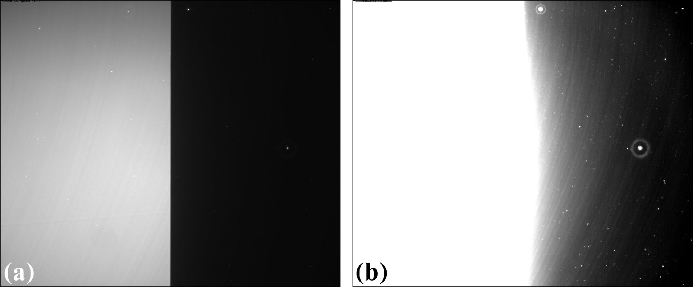
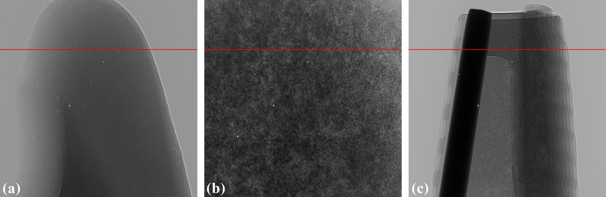
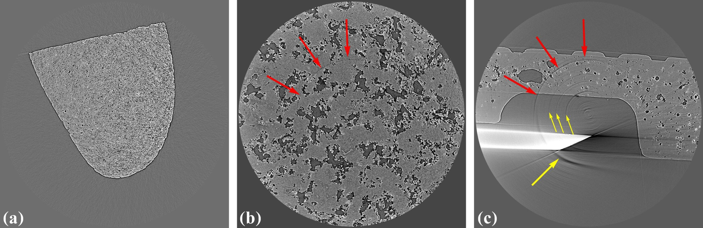
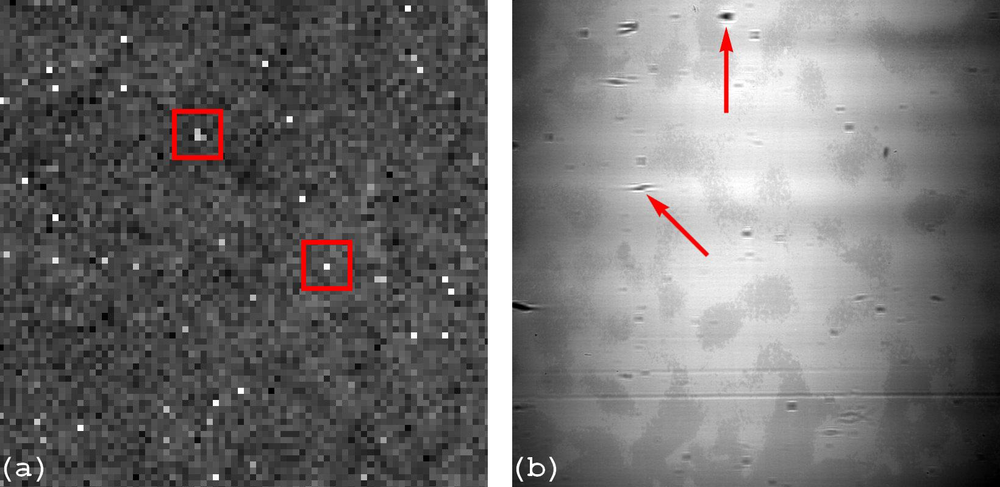

************************
Causes of ring artifacts
************************

  Figure 1. (a) Reconstructed image. (b) Sinogram.

Ring artifacts in a reconstructed image (Fig. 1a), corresponding to stripe
artifacts in a sinogram (Fig. 1b), come from two major sources:

   1. Irregular responses of a detecting system.
   2. Uncorrelated pixels between images with sample (projections) and images
      without sample (flat-field or white-field images).

**1.** Irregular responses of a detecting system are caused by defects in
different parts of the system such as the non-linear response of a sensor chip,
dust on optics components (lens, mirrors…), and especially a scintillator,
which is the major contributor. As can be seen in Fig. 2, defects from a scintillator
are clearly visible.

.. figure:: section1_figs/fig2.jpg
  :figwidth: 50 %
  :align: center
  :figclass: align-center

  Figure 2. Flat-field image shows defects of a scintillator

However, there are invisible defects which also result in stripe artifacts but
can only be revealed by analysing the linear response of a detector. Analysis
can be performed by acquiring projections through an X-ray absorber (e.g a glass
plate) at different thicknesses by rotating the plate in the range of 0 degree
to ~80 degree (to make sure that the plate doesn't block X-ray completely)
. Lines were fitted to the measured intensities of every pixel based on the
Beer-Lambert’s law. Intercepts and slopes of the fitting results of all
pixels (Fig. 3) help to reveal the underlying information about the quality of the
scintillator.

  Figure 3. Analysis of the linear response of the detector, giving the image in
  Fig. 2, helps to reveal underlying defects. (a) X-ray intensities are
  varied by rotating an X-ray attenuator. (b) Intercepts of the fitting results.
  (c) Slopes of the fitting results.

Retrieved response maps are useful to characterize detector systems and can
be used to correct irregular responses of large size detectors where the response
of each pixel is independent. However, in synchrotron-based microtomography
systems, where scintillators are mainly unstructured types to achieve high
resolution, this cannot be done due to the scattering of scintillation photons (Fig. 4)
making the response of each pixel depend on its neighbors.

  Figure 4. Demonstration of the scattering of scintillation photons in a
  scintillator-coupled X-ray detector by taking a flat-field image with a half
  field of view blocked. (a) Under 0.05s of exposure time. (b) Under 0.5s of
  exposure time.

As a result, the shape and absorption characteristics of a sample dictate the
influence of scattered light to the response of a pixel. This means that the
occurrence of artifacts depend on samples and projection angles. Figure 6
shows reconstructed images at the same slice of three samples with different
shapes and absorption characteristics (Fig. 5) where all tomographic datasets
were collected under the same conditions. As can be seen, there are ring
artifacts in sample 3 which don't occur in sample 1 and 2.

  Figure 5. Flat-field-corrected projections from three different types of
  samples. (a) Sample 1 giving a low dynamic range of transmitted intensities.
  (b) Sample 2 giving a medium dynamic range of transmitted intensities. (c)
  Sample 3 giving a high dynamic range of transmitted intensities.

  Figure 6. Occurrence of ring artifacts is sample-dependent as can be seen
  in the reconstructed images of three samples at the same detector row. (a) Sample
  1. (b) Sample 2. (c) Sample 3.

**2.** The second source of ring artifacts comes from the flat-field correction
process based on the Beer-Lambert’s law

.. math::

  \frac{I}{I_0} = \int_{}e^{-\alpha (x,y,z) dx}

in practice, it is done using the following formula

.. math::

  \frac{P_{\theta}-D}{F-D}

where :math:`P_{\theta}` is a projection image of a sample at a rotation
angle of :math:`\theta`, :math:`D` is a dark-field image taken with a photon
source off, and :math:`F` is a flat-field image taken without the sample.
This process is applied to all projections and it is here that fixed features
in a flat-field image which are uncorrelated to projection images give
rise to stripe artifacts in sinograms or ring artifacts in reconstructed
images. Figure 7 shows two types of fixed features which can be found in
flat-field images. The first one is zingers caused by scattered x-rays
hitting the CCD chip directly (Fig. 7(a)). The second one is blobs
(Fig. 7(b)) introduced by X-ray optics components in a synchrotron-based tomography system.
These blobs can be shifted during data acquisition process due to the heat load
resulting in uncorrelated pixels between projections and the flat-field image.

  Figure 7. Examples of some fixed features can be found in the flat-field images.
  (a) Zingers. (b) Blobs come from X-ray optics components.
