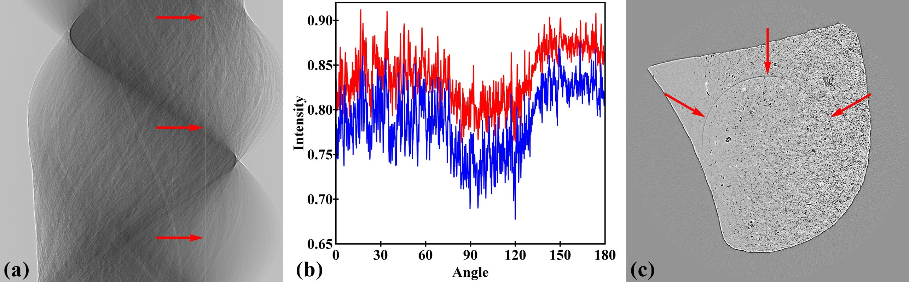
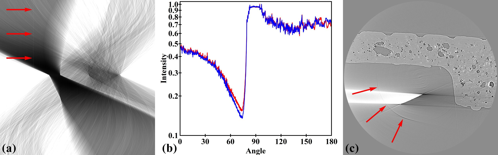
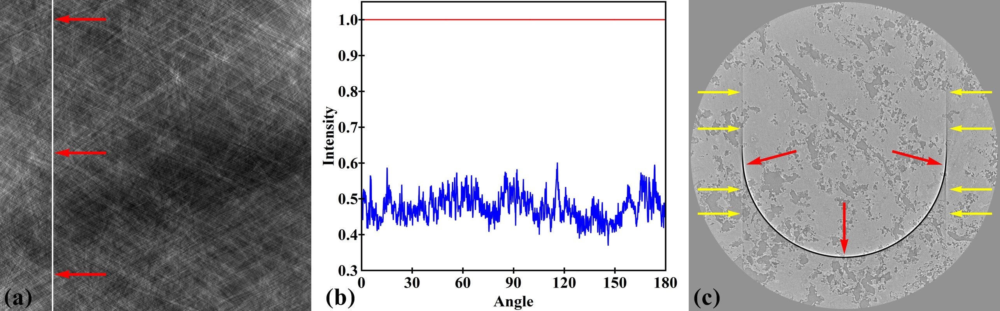
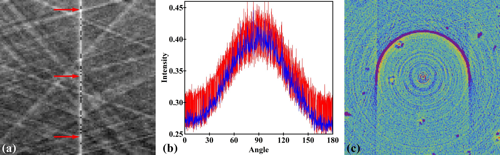
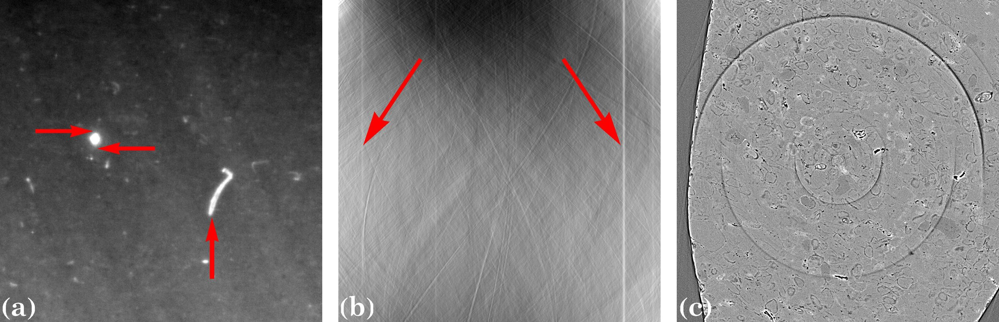
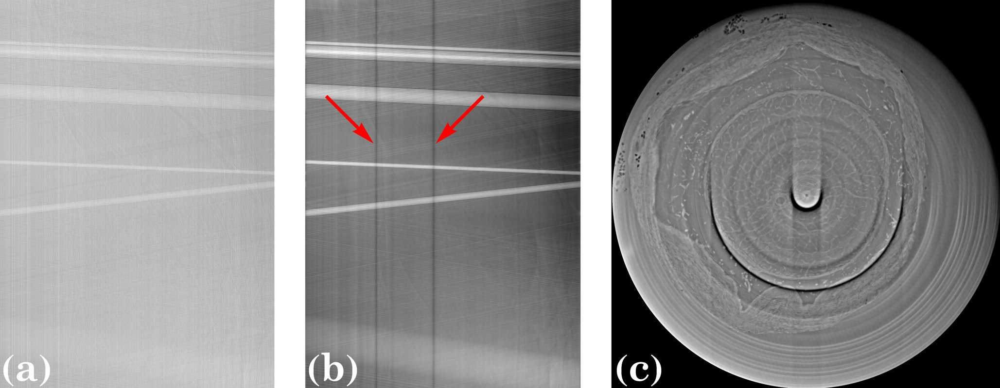

***************************************
Classification of stripe artifact types
***************************************

Occurrence of stripe artifacts (ring artifacts in reconstructed images)
depending on a sample makes it difficult to find a generic approach for
removing them. Furthermore, there are many types of stripe artifacts which may
require different ways of treatment. The use of pre-processing techniques such
as distortion correction or phase retrieval blurs and enlarges these stripes,
making it even more challenging to clean them. It is important to understand
physical causes of stripe artifacts and classify them. This helps to tackle the
problem most efficiently. By comparing the intensity profile, which
is the plot of measured intensities against angles, of a defective pixel
with its adjacent non-defective pixel we can classify stripe artifacts into four
different types.

Full stripe
============

A typical profile of a full stripe exhibits intensities that are offset at all
angles compared with that of a neighboring good pixel (Fig. 1(a, b)). It gives
rise to a half-ring artifact (in 180-degree scanning tomography) in a reconstructed
image (Fig. 1(c)).

  Figure 1. Demonstration of the full stripe artifact. (a) Stripe in the sinogram
  (arrowed). (b) Intensity profile along the stripe (red color) in comparison
  with an adjacent good pixel (blue color). (c) Ring artifact in the
  reconstructed image.

Partial stripe
==============

Different to a full stripe, intensities of a partial stripe are offset only
at certain ranges of angles as demonstrated in Fig. 2. As a result, it gives
rise to a partial ring artifact in a reconstructed image (Fig. 2(c)).

  Figure 2. Demonstration of a partial stripe artifact. (a) Partial stripe in
  the sinogram (arrowed). (b) Intensity profile along the stripe (red color) in
  comparison with an adjacent good pixel (blue color). (c) Partial ring artifact
  in the reconstructed image.

.. _dead_stripe:

Unresponsive stripe
===================

Intensities of this type of stripe are independent of the angles. The pixel is
not responsive to the variation of intensity versus the angle as the same way
as its neighboring good pixel. This type of stripes may come from dead pixels
of a sensor chip, light-blocking dusts or damaged scintillator (bright blobs
in Fig. 3(a)) giving rise to stripes of constant brightness as clearly visible
in Fig. 3(b). Missing information in these stripes strongly affects the
reconstructed image; the constant intensity results in a prominent half-ring,
and high-frequency edges of the stripes cause severe streak artifacts
(Fig. 3(c)).

  Figure 3. Demonstration of an unresponsive stripe artifact. (a) Unresponsive
  stripe in the sinogram (red arrows). (b) Intensity profile along the stripe
  (red color) in comparison with an adjacent good pixel (blue color). (c) Ring
  artifact (red arrows) and streak artifacts (yellow arrows) in the
  reconstructed image.

Fluctuating stripe
==================

Intensities fluctuate significantly across angles. This type of stripes
may come from defective pixels of a sensor chip rather than optical
components. They are extremely small in number and their size is often between 1 or
2 pixels. Like unresponsive stripes, they give rise to both ring artifacts
and streak artifacts as demonstrated in Fig. 4.

  Figure 4. Demonstration of a fluctuating stripe artifact. (a) Fluctuating
  stripe in the sinogram (zoomed in and arrowed). (b) Intensity profile along
  the stripe (red color) in comparison with an adjacent good pixel (blue color).
  (c) Ring artifact and streak artifacts in the reconstructed image.

.. _other_stripes:

Other types of stripes
======================

There are other types of stripes which are combinations of above stripes
or the extension of them such as large stripes (Fig. 5) or blurry stripes.
Blurry stripes may come from the use of pre-processing methods such as phase
retrieval or distortion correction.  Large stripes are caused by large defects
in a detector which are not always visible in radiographs. They may come from
adjacent areas of a damaged scintillator which receives extra scattering light,
i.e. the so-called halo effect, as shown in Fig. 5. Large stripes may need a separate
treatment to reduce side effects of cleaning methods.

  Figure 5. Causes and impact of large stripes. (a) Large defects (vertical
  arrow) and the areas around the over-exposed blob (horizontal arrows) cause
  large stripes. (b) Large stripes in the sinogram (arrowed). (c) Large ring
  artifacts in the reconstructed image.

  Figure 6. Demonstration of blurry stripes caused by applying a low-pass filter
  to 2D projections. (a), (b) Sinograms at the same row of the detector
  before and after the low-pass filter used. (c) Blurry ring artifacts in the
  reconstructed image.
