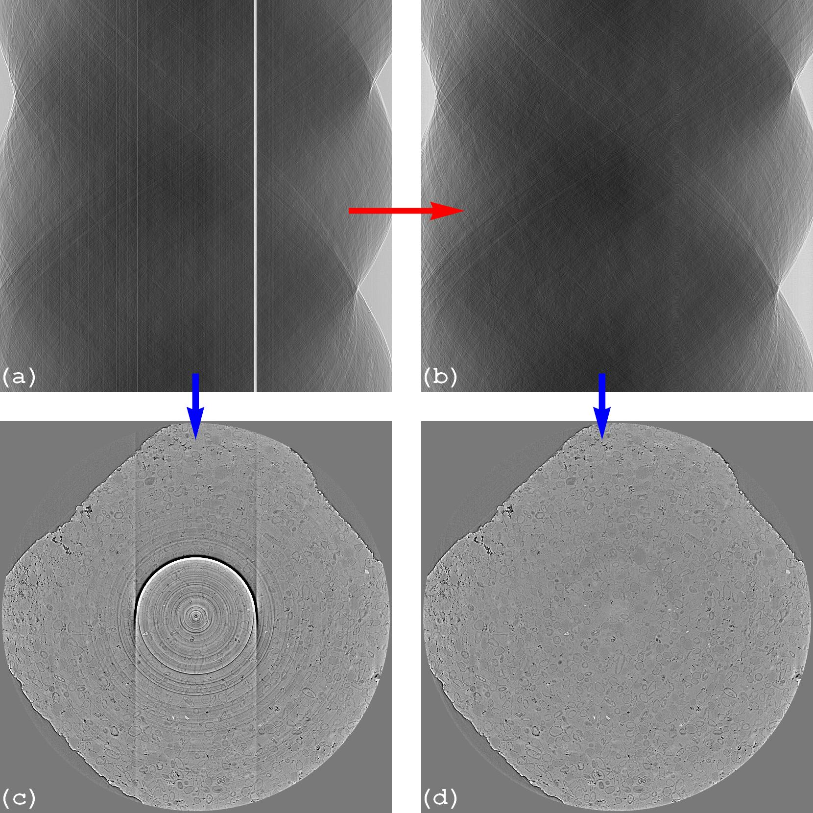
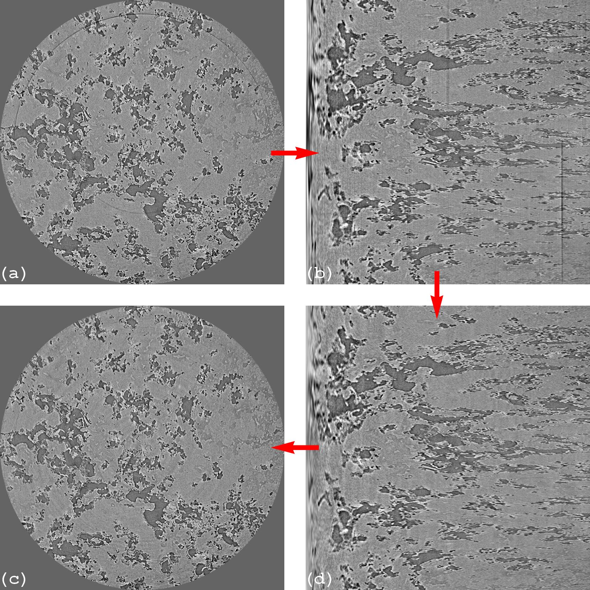
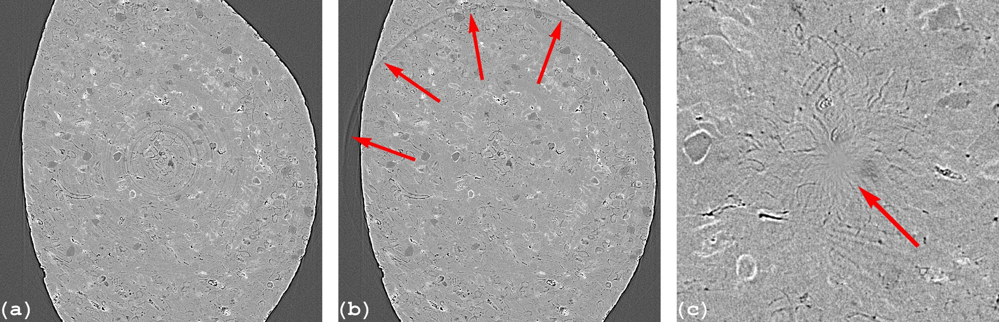

***********************************
Methods of removing ring artifacts
***********************************

Preprocessing methods
=====================

  Figure 1. Preprocessing methods work on sinogram space . (a) Sinogram before
  correction. (b) Sinogram after correction. (c) Reconstructed image from
  sinogram (a). (d) Reconstructed image from sinogram (b).

Lots of methods for removing ring artifacts in the sinogram space, where the
artifacts appear as straight lines or stripe artifacts, were proposed. They use
all sorts of image processing methods: smoothing filter, segmentation, interpolation...
It is easier to classify these methods based on assumptions about causes of artifacts
they rely on. There are 4 basic assumptions:

1. Stripe artifacts are caused by differences in offsets of intensities
   between neighboring pixels (i.e the full stripe type). Most of methods rely on
   this assumption. They use different ways of calculating these offsets and
   mainly use the average of intensities along the angular direction of a
   sinogram to detect stripes. This assumption is valid for a detector
   system where the response of each pixel is quite independent, e.g in a large
   area detector used for a cone-beam lab-based tomography system.

2. Stripe artifacts are corresponding to high-frequency components in the
   Fourier domain. As a result, they can be removed by damping these components.
   Methods relying on this assumption risk to introduce extra artifacts due to
   side effects of damping other high-frequency features.

3. Stripe artifacts are caused by mismatches between a flat-field image and projections.

4. Stripe artifacts are caused by differences in responses (to incomming
   photons) between neighboring pixels. These methods are the main part of this
   documentation.

We will analyse implementations of the methods relied on the assumption 1, 2,
and 4 in details to understand the pros and cons of each method, to know how to
use them efficiently and how to improve them. As there are many methods for
removing stripe artifacts and each of them works best on the certain types of
stripes, a rule of thumb is that users need to assess: the quality of a
flat-field image; sizes of stripe artifacts; the dynamic
range of sinogram intensities; and intensity profiles of pixels inside
stripes in comparison to their neighbors; to find the best combination of
methods.

.. toctree::

    section3_1/section3_1_1
    section3_1/section3_1_2
    section3_1/section3_1_3
    section3_1/section3_1_4
    section3_1/section3_1_5
    section3_1/section3_1_6

Postprocessing methods
======================

  Figure 2. Postprocessing methods work on the reconstruction space . (a)
  Reconstructed image before correction. (b) Polar transformation of image (a).
  (c) Stripe artifacts removed from image (b). (d) Cartesian transformation of
  image (c).

These methods work on the reconstruction space by transforming the problem of
removing ring artifacts to the problem of removing stripe artifacts using the
polar transformation (Fig. 2). It is important to know that the assumptions
of 1 and 4 above, used by pre-processing methods to remove stripe artifacts, are
not applicable to a transformed image. These assumptions are based on
the underlying physics of a detecting system and the standard way of acquiring
tomographic data which are no more valid in the reconstruction space. Postprocessing
methods are popularly used in cone-beam tomography for a few reasons:

- Due to the cone-beam geometry, reconstructing a slice requires a few adjacent
  sinograms (i.e multiple-rows of projection images). This means that
  pre-processing methods need to be adapted to work on a 3D image. This is
  not convenient and can be computationally expensive.

- To reduce the cone-beam artifacts, tomographic data are often acquired using a
  full rotation (360-degree) scan. This results full ring artifacts instead of
  haft ring artifacts with residual streak artifacts as in a 180-degree scan
  (Fig. 1(c)). This goes well with the polar transformation.

- Commercial cone-beam systems often go with their own reconstruction softwares
  which may only output reconstructed images to end-users.

There are limitations of postprocessing methods which users need to be aware
of: they can't remove side effects of unresponsive and fluctuating stripe artifacts (section 2)
which not only give rise to ring artifacts but also streak artifacts in
a reconstructed image (Fig. 1(c)); they can yield void-center artifacts
caused by over-smoothing the over-sampled areas of the transformed image (left
sides of Fig. 2(b,d)); there is information loss and artifact propagation
during the transformation between the polar and Cartesian coordinate systems.

.. toctree::

    section3_2/section3_2_1

Common side effects of ring artifact removal methods
====================================================

Methods relying on the assumptions 1 and 2 in section 3.1 often introduce
two side-effect artifacts: extra ring artifacts (Fig. 3(b)) and void-center
artifacts (Fig. 3(c)). Void-center artifacts are introduced by over-adjusted
parameters. Extra ring artifacts are introduced by the false detection of
stripes or by damping high-frequency components which are not corresponding
to stripe artifacts. These side effects are often observed in X-ray
synchrotron-based micro-tomography where there is the edge-enhancement effect
caused by a coherent X-ray source. This effect increases the high-frequency
components of an image which affects the performance of the mentioned methods.

  Figure 3. Side effects of ring removal methods relying on the assumptions 1
  and 2 in section 3.1. (a) Reconstructed image without ring removal. (b) Extra
  ring artifacts. (c) Void-center artifacts.
