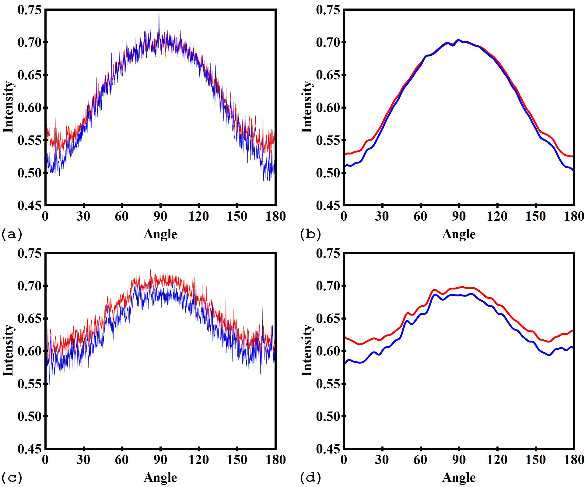

Equalization-based methods for removing partial and full stripe artifacts
=========================================================================

.. |br| raw:: html

    

  Figure 1. Characteristic intensity profile of a defective pixel (red color)
  in comparison with an adjacent good pixel (blue color). (a) Partial stripe.
  (b) Low-pass filter of the intensities in (a). (c) Full stripe. (d) Low-pass
  filter of the intensities in (c)

As can be seen in Fig.1, the differences in low-frequency components between the intensity
profiles of adjacent pixels are the causes of stripe artifacts.
To remove these stripes, we need to equalize the responses of these pixels.
This can be done by applying a smoothing filter along the horizontal direction.
This approach, however, can't be used directly on a sinogram image as it introduces
void-center artifacts and blurs the reconstructed image. To workaround these
problems, the sinogram can be transformed or pre-processed to reveal underlying
response curves, then a smoothing filter or a correction method can be applied.
There are three different ways of extracting the underlying responses as
shown below; ordered from fine to coarse extraction.

.. _sorting:

Sorting-based approach
----------------------

  .. autofunction:: sarepy.prep.stripe_removal_original.remove_stripe_based_sorting

  How it works
    This is a very simple but efficient method. It retrieves the response of
    each pixel by sorting intensities along each column of a sinogram. Then,
    the median filter is applied along the horizontal direction to remove stripes.
    The resulting image is re-sorted to get back the sinogram image. This
    approach can be explained using the following approximating assumptions:
    adjacent areas of a detector system are sampling the same range of
    incoming flux because a sample has continuous variation in intensity;
    irregular areas are small compared to the representative level of details
    in the sample. If the detector system is ideal, the total range of
    brightness observed at neighboring pixels should be the same. This means
    that if the measured intensities are sorted in order of brightness, we
    should expect the same distribution in neighboring pixels. Under the
    assumption of small irregular areas, we can use the brightness sorted
    values to identify, compare and correct the irregular areas. Applying a
    smoothing filter is the easiest way of correction. To transform
    back and forth between the normal sinogram and the sorted sinogram, the
    intensities in each column are coupled with their indexes. This is a very
    handy technique and can be useful elsewhere. The visual explanation of the
    method is as follows (use the browser zoom to see the details).

    .. figure:: section3_1_1_figs/sorting_method/fig1.jpg
      :figwidth: 100 %

      Step 1. Original sinogram (a) is coupled with an index matrix (b). (c)
      is the reconstructed image from (a).

    .. figure:: section3_1_1_figs/sorting_method/fig2.jpg
      :figwidth: 66.67 %

      Step 2. Intensities of each column are sorted (a). The index matrix is
      changed correspondingly (b).

    .. figure:: section3_1_1_figs/sorting_method/fig3.jpg
      :figwidth: 100 %

      Step 3. Sorted image is smoothed along the horizontal direction (a).
      Corrected sinogram (b) is re-sorted using the index matrix in the previous
      step. (c) is the reconstructed image from (b).

  How to use
    -- Users adjust the *size* of the median filter to adjust the strength of the
    method. Larger is stronger. A rule of thumb is that it should be larger than the largest
    size of stripes, but not too large to increase side-effect artifacts,
    which are streak artifacts (Fig. 2). The tolerance range of the window size
    depends on the complexity of the sorted sinogram (Step 2(a)). In most cases,
    it's pretty simple. This means that we can use the same *size* across
    sinograms of a 3D tomographic data.

    .. figure:: section3_1_1_figs/sorting_method/fig4.jpg
      :figwidth: 50 %
      :align: center

      Figure 2. Difference in the reconstruction space between the corrected
      sinogram using the size of 71 and the one using the size of 31 (not much
      different if using 30 or 32). Sinograms for testing are available
      `here <https://github.com/nghia-vo/sarepy/tree/master/data>`_.

    -- Users can choose to apply a 1D smoothing filter or 2D smoothing filter
    using the *dim* parameter. However, the 1D filter is good enough for most
    of the cases.

  Pros
    -- It is very simple to use and works particularly well to remove partial
    stripes. |br|
    -- It does not yield extra stripe artifacts and void-center artifacts. |br|
    -- Fixed parameters can be used for full datasets.

  Cons
    -- It can introduce streak artifacts. |br|
    -- The method uses the whole range of intensities for sorting while it is the
    low-pass components need to be corrected. This means that if the ratio of
    the high-pass components is high (e.g noisy data) it can alter the sorting
    order which results streak artifacts. |br|
    -- It won't work well on synthetic stripes, stripes introduced by
    tomographic alignment, or any stripes where rankings of intensities are
    significantly different between pixels inside stripes and outside stripes. |br|

  How to improve
    -- The median filter, an edge-preserving smoothing filter, is used to reduce
    the side effect of introducing streak artifacts. However, for sinograms
    without sharp jumps of intensities between columns, other types of
    smoothing filters, which are stronger and faster, can be used (Fig. 3). This
    can be useful to remove the low-frequency ring artifacts in a low-contrast
    reconstructed image. |br|
    -- The smoothing filter is not applied to a small percentage of pixels at
    the top and bottom of the sorted image. This can reduce the streak
    artifacts. |br|
    -- The method can be used only to the low-pass components of
    sinogram columns by combing with the filtering-based approach as will
    be shown below. |br|

    .. figure:: section3_1_1_figs/sorting_method/fig5.jpg
      :figwidth: 100 %
      :align: center

      Figure 3. Results of the sorting-based approach where the gaussian filter
      with the sigma of 31 is used instead of the median filter. (a) Original
      sinogram. (b) Sorted sinogram. (c) Smoothing of the sorted sinogram. (d)
      Corrected sinogram. (e) Reconstructed image.

Filtering-based approach
------------------------

  .. autofunction:: sarepy.prep.stripe_removal_original.remove_stripe_based_filtering

  How it works
    It uses directly the assumption shown in Fig. 1 by: extracting the low-pass
    components of each column using the Fourier transform, applying a
    smoothing filter across columns, combing the result with the high-pass
    components. The visual explanation of the method is as follows.

    .. figure:: section3_1_1_figs/filtering_method/fig1.jpg
      :figwidth: 66.67 %

      Step 1. Original sinogram (Fig. 3(a)) is separated into the low-pass
      components (a) and the high-pass components (b).

    .. figure:: section3_1_1_figs/filtering_method/fig2.jpg
      :figwidth: 100 %

      Step 2. (a) Low-pass image is smoothed along the horizontal direction.
      Corrected sinogram (b) is formed by adding image (a) and the high-pass
      components (Step 1(b)). (c) is the reconstructed image from (b).

  How to use
    -- The *sigma* parameter controls the size of the window (in the Fourier
    space) used for separating the low-pass components and the high-pass
    components. It should be chosen in the range of (0 -> 10) as higher values
    give rise to void-center artifacts. |br|
    -- The *size* parameter controls the strength of the median filter.
    Larger is stronger. |br|
    -- The *dim* parameter allows to select the 1D or 2D median filter.

  Pros
    -- It is an intuitive method and easy to use. |br|
    -- It does not yield extra stripe artifacts. |br|

  Cons
    -- It can yield void-center artifacts. |br|
    -- It can result in streak artifacts. |br|
    -- It doesn't work well on sinograms having sharp jumps of intensities
    between columns, e.g the sinogram used in section 3.1.1.1.

  How to improve
    -- Different `windows <https://docs.scipy.org/doc/scipy/reference/signal.windows.html>`_ can be used to separate the low-pass components. |br|
    -- Can be used with other edge-preserving smoothing filters. |br|
    -- The problem of yielding void-center artifacts can be solved by combining
    with the sorting-based method as below.

    .. autofunction:: sarepy.prep.stripe_removal_improved.remove_stripe_based_filtering_sorting

Fitting-based approach
----------------------

  .. autofunction:: sarepy.prep.stripe_removal_original.remove_stripe_based_fitting

  How it works
    This method is an extreme of the filtering-based method where low-pass
    components are extracted by applying polynomial fitting in the real space. Because
    of that it is limited to be used for sinograms having low dynamic range of
    intensities where its low-pass components can be represented by a low order
    polynomial fit. Steps of the method are: applying a polynomial fit to each
    column using the same order resulting the fitted sinogram; applying a smoothing filter along the
    horizontal direction to remove vertical stripes; multiplying the
    smoothed sinogram by the original sinogram, then dividing the result by the
    fitted sinogram. The visual explanation of the steps is as follows.

    .. figure:: section3_1_1_figs/fitting_method/fig1.jpg
      :figwidth: 100 %

      Step 1. Polynomial fitting is applied to the original sinogram (a)
      resulting the fitted sinogram (b). (c) is the reconstructed image from (a).

    .. figure:: section3_1_1_figs/fitting_method/fig2.jpg
      :figwidth: 100 %

      Step 2. Smoothed sinogram (a) is generated by applying the FFT-based
      smoothing filter to the fitted sinogram. The corrected sinogram is the result of
      multiplying the original sinogram by the smoothed sinogram then dividing
      the result by the fitted sinogram. (c) is the reconstructed image from (b).

  How to use
    -- The *order* parameter allows to select the polynomial order for fitting.
    It should be chosen in the range of (1->5). |br|
    -- The *sigmax* parameter controls the strength of the cleaning capability.
    Smaller is stronger (as it works in the Fourier space). Recommended values: 2-> 20. |br|
    -- The *sigmay* parameter can help to reduce the side effects and is
    insensitive. Recommended values: 50 -> 200.

  Pros
    -- Powerful method for removing blurry stripes or low-pass stripes. |br|
    -- Many choices for the smoothing filter.

  Cons
    -- Limited to be used on sinograms having low dynamic range of intensities,
    i.e. its low-frequency components can be fitted to a low order polynomial. |br|
    -- Can yield extra stripe artifacts if there are sharp jumps in intensities
    of each sinogram column.

  How to improve
    -- Can be used with different smoothing filters. |br|
    -- Can be combined with the sorting-based method to work with more complex
    sinograms.

    .. autofunction:: sarepy.prep.stripe_removal_improved.remove_stripe_based_sorting_fitting
