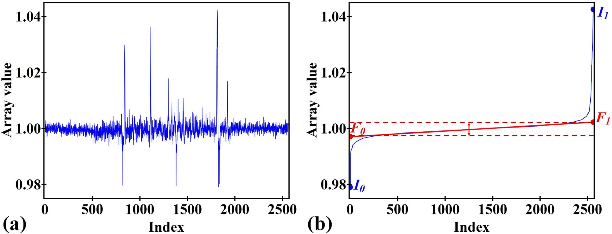

Method for locating stripe artifacts
====================================

.. |br| raw:: html

    

.. _stripe_detection:

The techniques described in the previous sections are able to remove full and
partial stripe artifacts which are of small or medium size without significantly
affecting other areas. However, for large stripes, applying a stronger filter
to the whole sinogram will degrade the final image. Furthermore, large stripes
are few in number. In this case, the correction could be selectively applied
only on defective pixels. |br|
There are other types of stripe artifacts which can't be removed using the
previous approaches such as unresponsive stripes, fluctuating stripes, synthetic
stripes, or stripes introduced by tomographic alignment or cone-beam
parallel-beam conversion. A practical approach is to locate them first, and then
remove them using interpolation methods. |br|
A segmentation algorithm which works on a 1D array to locate stripes was proposed
in [1]. It's very efficient and simple to use. Depending on the types of
stripe artifacts, different pre-processing steps are used to generate an 1D
array which then is input to the segmentation algorithm.  Steps of this
algorithm, called SFTS (Sorting, Fitting, and Thresholding-based Segmentation)
for short, is described as follows and demonstrated in Fig. 1.

  Figure 1. Demonstration of the segmentation algorithm. (a) Normalized 1D array,
  i.e. non-uniform background is corrected. (b) Sorted array and fitted array
  using the middle part of the sorted array.

.. autofunction:: sarepy.prep.stripe_removal_original.detect_stripe

How it works
  As can be seen in Fig. 1(a), it is difficult to segment the array as one
  doesn't know which thresholding values should be used. However, if the array
  values are sorted (Fig. 1(b)), the segmentation task is much easier. If a
  straight line is drawn along the middle part of the sorted array, it cuts the
  vertical lines at two points. Vertical distance between these points
  corresponds to noise level. Values higher than this level at a certain
  ratio, which is a user-input value, corresponds to stripe locations. Steps
  of the algorithm are as follows. |br| |br|
  **Step 1:** Sort values of a 1D array into ascending order. |br| |br|
  **Step 2:** Apply a linear fit to the values around the middle of the
  sorted array, i.e. half of the array size, respect to the array indexes. |br| |br|
  **Step 3:** Calculate the upper threshold, :math:`T_{U}`, and the lower
  threshold, :math:`T_{L}`, using the following formula: |br|
  If :math:`(F_{0}-I_{0})/(F_{1}-F_{0})>R,`

  .. math::

    T_{L} = F_{0} - (F_{1} - F_{0}) \times R / 2

  If :math:`(I_{1}-F_{1})/(F_{1}-F_{0})>R,`

  .. math::

    T_{U} = F_{1} + (F_{1} - F_{0}) \times R / 2

  where :math:`I_{0}` and :math:`I_{1}` are the minimum and maximum value of
  the sorted array; :math:`F_{0}` and :math:`F_{1}` are the fitted value at
  the first and last index of the array; and :math:`R` is a user-input value. |br| |br|
  **Step 4:**	Binarize the array by replacing all values between :math:`T_{L}`
  and :math:`T_{U}` with 0 and others with 1.
