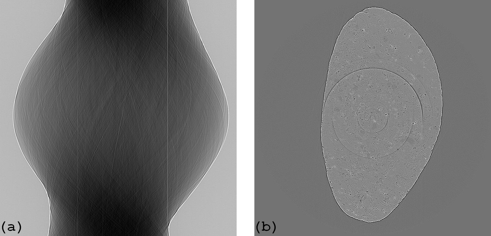

.. _remove_large_stripe:

Method for removing large stripes
=================================

.. |br| raw:: html

    

A strongly smoothing filter is needed to remove :ref:`large stripes <other_stripes>`
. This, however, degrades the final sinogram and gives rise to extra artifacts.
To solve these problems, the correction is selectively applied to stripe locations
only, which requires the :ref:`stripe detection method <stripe_detection>`.
Detailed implementations of the method is shown as follows.

  Figure 1. (a) Sinograms with large stripe artifacts. (b) Reconstructed image.

**Python source code:**

  .. autofunction:: sarepy.prep.stripe_removal_original.remove_large_stripe

**How it works:**

  1 - Locating stripe artifacts
    -- Sort intensities in each column of the sinogram (Fig. 2(a)). Apply the
    strong median filter along each row to remove stripes (Fig. 2(b)).

    .. figure:: section3_1_4_figs/fig2.jpg
      :figwidth: 80 %
      :align: center
      :figclass: align-center

      Figure 2. (a) Sorted sinogram. (b) Smoothed sinogram.

    -- Average along the columns of the sorted sinogram where some percentage
    of pixels at the top and bottom are dropped (Fig. 3(a), Fig. 4(a)). Do the
    same for the smoothed sinogram (Fig. 3(b), Fig. 4(b)). This simple technique
    helps to reduce the possibility of wrongly detecting stripes caused by
    high-frequency edges of the sinogram . It also can be used to improve other
    ring removal :ref:`methods <norm_method>`.

    .. figure:: section3_1_4_figs/fig3.jpg
      :figwidth: 80 %
      :align: center
      :figclass: align-center

      Figure 3. (a) Selected area for averaging in the sorted sinogram.
      (b) Selected area for averaging in the smoothed sinogram.

    .. figure:: section3_1_4_figs/fig4.jpg
      :figwidth: 90 %
      :align: center
      :figclass: align-center

      Figure 4. (a) Average result of the ROI in Fig. 3(a). (b) Average result of
      the ROI in Fig. 3(b).

    -- Divide the result shown in Fig. 4(a) to the result shown in Fig. 4(b) resulting
    in the normalized 1D array (Fig. 5(a)). Use the :ref:`SFTS algorithm <stripe_detection>`
    to get stripe locations (Fig. 5(b)).

    .. figure:: section3_1_4_figs/fig5.jpg
      :figwidth: 90 %
      :align: center
      :figclass: align-center

      Figure 5. (a) Normalized 1D array used for the SFTS algorithm. (b) Mask
      indicating the stripe locations.

  2- Normalization
    -- Normalize each row of the sinogram using the result shown in Fig. 5(a). This
    step is important to correct the non-uniform background around :ref:`large stripes <other_stripes>`.
    Actually, it is a normalization-based stripe removal method. As a result,
    it can suppress full stripe artifacts but not partial stripe artifacts (Fig. 6).

    .. figure:: section3_1_4_figs/fig6.jpg
      :figwidth: 85 %
      :align: center
      :figclass: align-center

      Figure 6. (a) Normalized sinogram. (b) Reconstructed image from sinogram (a).

  3- Selective correction
    -- Partial stripes are removed using the sorting-based approach where only the
    intensities in the stripes of the normalized sinogram are corrected (Fig. 7).

    .. figure:: section3_1_4_figs/fig7.jpg
      :figwidth: 85 %
      :align: center
      :figclass: align-center

      Figure 7. (a) Corrected sinogram. (b) Reconstructed image from sinogram (a).

**How to use:**

  -- The *snr* parameter controls the sensitivity of the stripe detection
  method. Smaller is more sensitive. Recommended values: 1.1 -> 3.0. |br|
  -- The *size* parameter controls the strength of the median filter and can
  be determined in a straightforward way by the size and the brightness of
  detector defects. Larger is stronger but more computationally expensive.
  As this method is selective correction, overestimated *size* is acceptable
  without degrading the final image too much. This allows users
  to use the same parameters across sinograms.

**How to improve:**

  The median filter can be replaced by another edge-preserving smoothing filter.
