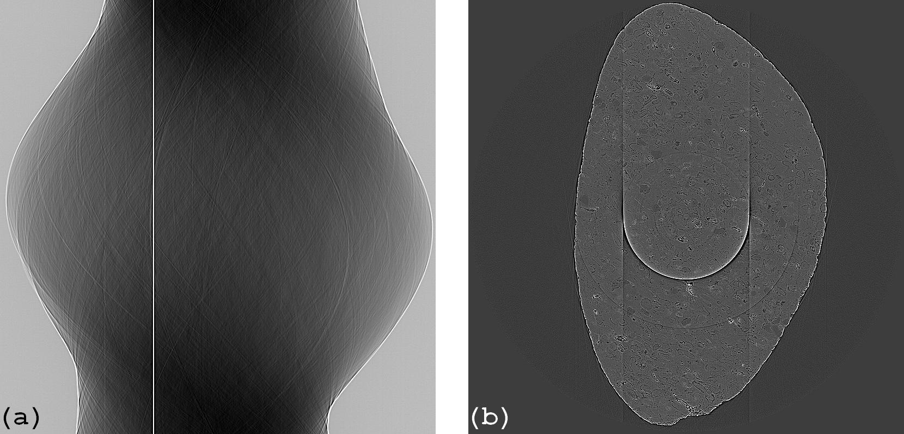

.. _remove_dead_stripe:

Method for removing unresponsive and fluctuating stripes
========================================================

.. |br| raw:: html

    

:ref:`Unresponsive and fluctuating stripes <dead_stripe>` give rise to both ring
artifacts and streak artifacts in the reconstructed image (Fig. 1). Unfortunately, they
cannot be removed using the smoothing-based approaches as in the previous
methods because intensity profiles are significantly different
between pixels inside stripes and outside stripes.  A simple way of
removing them is to use an interpolation technique after locating them.
The intensity profiles of those stripes show opposite characteristics. The
unresponsive stripe shows very little variation while the fluctuating stripe
shows excessive variation. Exploiting these features can help us detect them all
together.

  Figure 1. (a) Sinogram with unresponsive stripe artifacts and fluctuating
  stripe artifacts (zoom-in needed). (b) Reconstructed image.

**Python source code**

  .. autofunction:: sarepy.prep.stripe_removal_original.remove_unresponsive_and_fluctuating_stripe

**How it works**

  1 - Locating stripe artifacts
    -- Apply the strong mean filter along each column of the sinogram
    (Fig. 2(a)). Take absolute values of the difference between the result
    and the original sinogram (Fig. 1(a)) resulting in Fig. 2(b).

    .. figure:: section3_1_5_figs/fig2.jpg
      :figwidth: 80 %
      :align: center
      :figclass: align-center

      Figure 2. (a) Smoothed sinogram along the verstical direction. (b)
      Absolute difference between (a) and Fig. 1(a).

    -- Average along each column of Fig. 2(b) resulting a 1D array (Fig. 3(a)). Apply the
    strong median filter to this array resulting in Fig. 3(b).

    .. figure:: section3_1_5_figs/fig3.jpg
      :figwidth: 80 %
      :align: center
      :figclass: align-center

      Figure 3. (a) Result of averaging each column of Fig. 2(b). (b) After
      applying the median filter to (a).

    -- Divide the result shown in Fig. 3(a) to the result shown in Fig. 3(b) resulting
    in the normalized 1D array (Fig. 4(a)). Use the :ref:`SFTS algorithm <stripe_detection>`
    to get stripe locations (Fig. 4(b)).

    .. figure:: section3_1_5_figs/fig4.jpg
      :figwidth: 90 %
      :align: center
      :figclass: align-center

      Figure 4. (a) Normalized 1D array used for the SFTS algorithm. (b) Mask
      indicating the stripe locations.

  2- Correcting by interpolation
    -- Interpolate values inside the stripes from neighboring pixels.

    .. figure:: section3_1_5_figs/fig5.jpg
      :figwidth: 85 %
      :align: center
      :figclass: align-center

      Figure 6. (a) Corrected sinogram. (b) Reconstructed image from sinogram (a).

  3- Removing residual stripes (Optional)
    -- Apply the algorithm of :ref:`removing large stripes <remove_large_stripe>`
    to remove residual stripes. This step may be needed because intensities
    around dead pixels are modulated by the scattered light resulting large stripes.

    .. figure:: section3_1_5_figs/fig6.jpg
      :figwidth: 85 %
      :align: center
      :figclass: align-center

      Figure 7. (a) Corrected sinogram. (b) Reconstructed image from sinogram (a).

**How to use**

  -- The *snr* parameter controls the sensitivity of the stripe detection
  method. Smaller is more sensitive. Recommended values: 1.1 -> 3.0. |br|
  -- The *size* parameter controls the strength of the median filter
  and can be determined in a straightforward way by the size of dead pixels.
